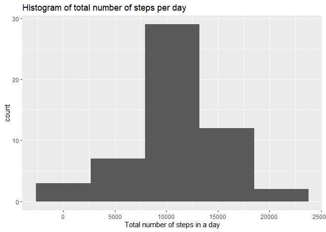

## Loading libraries


```r
library(tidyverse)
library(lubridate)
```
## Loading and preprocessing the data

**Note**: we should download and unzip the file in our current directory.


```r
df_all<-read.csv("activity.csv", stringsAsFactors = FALSE,colClasses = c("numeric","Date","integer"), na.strings = "NA")
```

## What is mean total number of steps taken per day?
Note: For this part of the assignment, you can ignore the missing values in the dataset.

1. Calculate the total number of steps taken per day

```r
df<-df_all %>% filter(!is.na(steps)) 
steps_daily<-df %>% group_by(date) %>% summarise(TotalSteps = sum(steps)) %>% ungroup()
head(steps_daily)
```

```
## # A tibble: 6 x 2
##   date       TotalSteps
##   <date>          <dbl>
## 1 2012-10-02        126
## 2 2012-10-03      11352
## 3 2012-10-04      12116
## 4 2012-10-05      13294
## 5 2012-10-06      15420
## 6 2012-10-07      11015
```

2. Make a histogram of the total number of steps taken each day

```r
ggplot(steps_daily,aes(x=TotalSteps)) + geom_histogram(bins = 5) + 
  labs(title ="Histogram of total number of steps per day") + xlab("Total number of steps in a day")
```

<!-- -->

3. Calculate and report the mean and median of the total number of steps taken per day


```r
mean(steps_daily$TotalSteps)
```

```
## [1] 10766.19
```

```r
median(steps_daily$TotalSteps)
```

```
## [1] 10765
```


## What is the average daily activity pattern?

1. Make a time series plot (i.e.type = "l") of the 5-minute interval (x-axis) and the average number of steps taken, averaged across all days (y-axis)


```r
avg_daily<- df %>% group_by(interval) %>% summarise(avg_steps = mean(steps)) %>% ungroup()
plot(x = avg_daily$interval, y = avg_daily$avg_steps, type="l",
     main="Average number of steps over all days", xlab="Interval", 
     ylab="Average number of steps")
```

<!-- -->

2. Which 5-minute interval, on average across all the days in the dataset, contains the maximum number of steps?

```r
avg_daily[which.max(avg_daily$avg_steps),] 
```

```
## # A tibble: 1 x 2
##   interval avg_steps
##      <int>     <dbl>
## 1      835      206.
```


## Imputing missing values

1. Calculate and report the total number of missing values in the dataset 

```r
sum(is.na(df_all$steps))
```

```
## [1] 2304
```

2. Devise a strategy for filling in all of the missing values in the dataset, in our case we will use the mean of steps without `NA` values.

```r
mean_steps<-mean(df$steps)
```


3. Create a new dataset that is equal to the original dataset but with the missing data filled in.

```r
df_fill<- df_all %>% mutate(steps = if_else(is.na(df_all$steps),mean_steps,steps))
```

4.Make a histogram of the total number of steps taken each day and Calculate and report the mean and median total number of steps taken per day. 

```r
steps_daily_fill<-df_fill %>% group_by(date) %>% summarise(TotalSteps = sum(steps)) %>% ungroup()

ggplot(steps_daily_fill,aes(x=TotalSteps)) + geom_histogram(bins = 5) + 
  labs(title ="Histogram of total number of steps per day") + xlab("Total number of steps in a day")
```

<!-- -->

```r
mean(steps_daily_fill$TotalSteps)  
```

```
## [1] 10766.19
```

```r
median(steps_daily_fill$TotalSteps)  
```

```
## [1] 10766.19
```
if we take these two values and compare them with previous values, we can see a small difference in the median, because it changes from `10,765` to `10,766.19` and of course this is due to the estimation of the missing values.


## Are there differences in activity patterns between weekdays and weekends?

1. Create a new factor variable in the dataset with two levels -- "weekday" and "weekend" indicating whether a given date is a weekday or weekend day.


```r
df_fill<-df_fill %>% mutate(day= weekdays(date),type_of_day = if_else(weekdays(date) %in% 
                                              c("sábado","domingo","Saturday","Sunday"),"weekend","weekday" )
                            ) 
df_fill$type_of_day<- factor(df_fill$type_of_day, levels = c("weekday","weekend"))
```


2. Make a panel plot containing a time series plot  of the 5-minute interval (x-axis) and the average number of steps taken, averaged across all weekday days or weekend days (y-axis). 

```r
avg_daily_fill<- df_fill %>% group_by(interval,type_of_day) %>% summarise(avg_steps = mean(steps)) %>% ungroup()
ggplot(avg_daily_fill,aes(x=interval,y=avg_steps)) + geom_line() + facet_grid(type_of_day~.) + 
  ylab("Avg Number of steps")
```

<!-- -->
